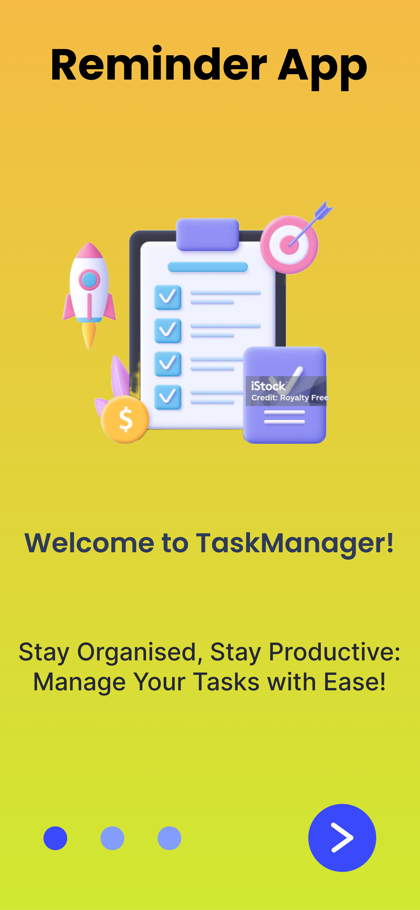
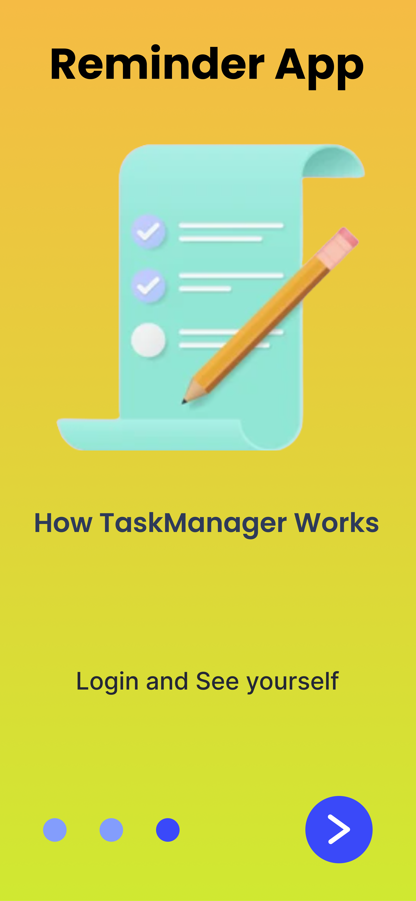
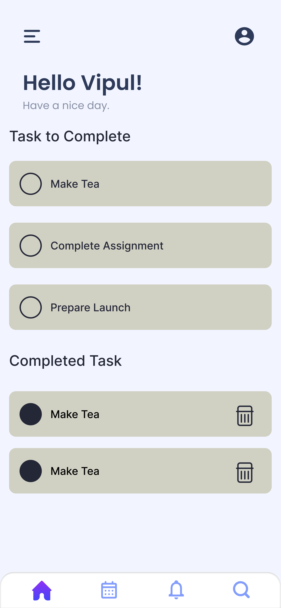

Here’s a detailed **README.md** file based on the features and tech stack you've shared:

---

# Reminder App

A feature-rich reminder application built with modern web and mobile development technologies. This app helps users organize their tasks efficiently with intuitive functionality and a seamless user experience.






## Features

1. **User Onboarding Screen**
   - A welcoming and interactive user onboarding process.
   - Provides a brief overview of the app's features.

2. **Login and Signup**
   - Secure user authentication with backend integration.
   - User registration and login capabilities.
   - Password validation and error handling for a smooth experience.

3. **Reminder Task Management**
   - Add tasks with custom details and deadlines.
   - Edit tasks to make modifications on the go.

4. **Completed Tasks**
   - View completed tasks at the bottom of the task list.
   - Enables users to keep track of their accomplishments.

---

## Tech Stack

### Frontend
- **React Native**: For creating cross-platform mobile applications.
- **Expo**: To streamline the development and testing process.
- **TypeScript**: Ensures robust and type-safe code.

### Backend
- **Node.js**: Handles server-side logic.
- **Express.js**: Provides a robust API framework.
- **MongoDB**: NoSQL database for secure and efficient data storage.

### Additional Tools
- **Git**: Version control for collaborative development.
- **Babel**: For JavaScript transpilation.
- **Yarn/NPM**: Dependency management.

---

## Installation and Setup

1. **Clone the repository**:
   ```bash
   git clone https://github.com/Vipul-Mhatre/Reminder-App.git
   cd reminder-app
   ```

2. **Install dependencies**:
   ```bash
   yarn install
   # or
   npm install
   ```

3. **Start the Expo development server**:
   ```bash
   expo start
   ```

4. **Backend setup**:
   - Navigate to the `api` directory and set up the backend:
     ```bash
     cd api
     npm install
     npm start
     ```
   - Ensure MongoDB is running locally or use a cloud-hosted MongoDB instance.

5. **Run on a device**:
   - Use the Expo Go app (iOS/Android) or an emulator to test the app.

---

## Directory Structure

```
reminder/
├── api/               # Backend code
├── app/               # Application configurations
├── assets/            # Static files (images, fonts)
├── components/        # Reusable UI components
├── scripts/           # Custom scripts
├── App.js             # Main app entry point
├── package.json       # Dependencies and scripts
├── tsconfig.json      # TypeScript configuration
```

---

## Contribution Guidelines

We welcome contributions! Please follow the steps below:
1. Fork the repository.
2. Create a feature branch: `git checkout -b feature-name`.
3. Commit your changes: `git commit -m "Description of changes"`.
4. Push the branch: `git push origin feature-name`.
5. Submit a pull request.

---

## License

This project is licensed under the [MIT License](LICENSE).